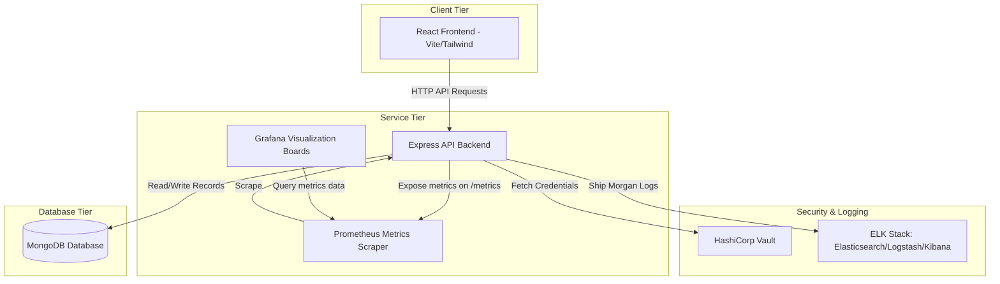

# GlobalMedX – Worldwide Pandemic Surveillance & Response Platform

GlobalMedX is an enterprise-grade, cloud-native disease surveillance and outbreak monitoring platform designed for real-time epidemic tracking, healthcare facility load audits, border screening records, and resource allocation logistics. This project demonstrates full-stack software development, automated provisioning, secrets management, container orchestration, monitoring, centralized logging, and CI/CD pipelines.

---

## System Architecture Diagram



---

## Project Structure

```
globalmedx/
├── frontend/         # React, Tailwind, Chart.js Portal
├── backend/          # Node.js, Express, prom-client REST API
├── database/         # MongoDB volume mappings (Local / Docker)
├── docker/           # Dockerfiles & docker-compose configurations
├── k8s/              # Kubernetes Deployments, Services, ConfigMaps, Secrets, HPAs, Ingress
├── terraform/        # AWS Provider EKS Infrastructure configs (VPC, IAM, Node Groups)
├── jenkins/          # Declarative Jenkinsfile pipeline definitions
├── monitoring/       # Prometheus config & Grafana dashboards
├── elk/              # Logstash pipelines & Kibana dashboard definitions
├── vault/            # HashiCorp Vault server configs and seeds
├── docs/             # Technical Deployment & Project Reports
└── README.md         # Master Readme
```

---

## Technical Port Index

| Service Name | Port | Description |
| :--- | :--- | :--- |
| Frontend Web Portal | `8080` (Compose) / `3000` (Local Dev) | User Interface |
| Backend Express REST API | `5000` | Node.js Backend & `/metrics` exporter |
| MongoDB Database | `27017` | Document Data Repository |
| HashiCorp Vault | `8200` | Secrets Store & Web UI console |
| Prometheus | `9090` | Time Series Scraper engine |
| Grafana | `3000` | Visualization dashboard (Credentials: `admin/admin`) |
| Elasticsearch | `9200` | Log Indexer engine |
| Logstash | `5044` | Log Ingester pipeline |
| Kibana | `5601` | Log Query GUI Panel |

---

## Verification & Deployment Runbook

### Option 1: Run Locally (Developer Mode)

1. **Database & Vault Setup:** Ensure MongoDB is running on `mongodb://localhost:27017/`.
2. **Start Backend:**
   ```bash
   cd backend
   npm install
   npm run dev
   ```
3. **Start Frontend:**
   ```bash
   cd ../frontend
   npm install
   npm run dev
   ```
4. Access the portal at `http://localhost:3000`. Authenticate using:
   - Admin: `admin@globalmedx.gov` / `admin123`
   - Officer: `officer@globalmedx.gov` / `officer123`

---

### Option 2: Run with Docker Compose (All Services Containerized)

1. **Boot all container services:**
   ```bash
   cd docker
   docker-compose up --build -d
   ```
2. **Initialize & Seed Vault Credentials:**
   Wait 10 seconds for the containers to fully start, then run:
   ```bash
   cd ../vault
   chmod +x init-vault.sh
   ./init-vault.sh
   ```
3. **Explore Dashboard Panels:**
   - Frontend Portal: `http://localhost:8080`
   - Backend APIs: `http://localhost:5000/api/health`
   - Prometheus metrics: `http://localhost:9090`
   - Grafana monitoring boards: `http://localhost:3000` (Credentials: `admin/admin`)
   - Kibana centralized logs: `http://localhost:5601`

---

### Option 3: Deploy to Kubernetes Cluster (Minikube / Cloud)

1. **Point your shell to the namespace folder:**
   ```bash
   cd k8s
   ```
2. **Apply resources in order:**
   ```bash
   kubectl apply -f namespace.yaml
   kubectl apply -f secrets.yaml
   kubectl apply -f configmap.yaml
   kubectl apply -f mongodb-deployment.yaml
   kubectl apply -f backend-deployment.yaml
   kubectl apply -f frontend-deployment.yaml
   kubectl apply -f ingress.yaml
   kubectl apply -f hpa.yaml
   ```
3. **Resolve Hostname Mapping:** Add EKS LoadBalancer IP or Minikube IP to `/etc/hosts`:
   ```text
   <IP-ADDRESS> globalmedx.local
   ```
4. Access `http://globalmedx.local` to verify.
