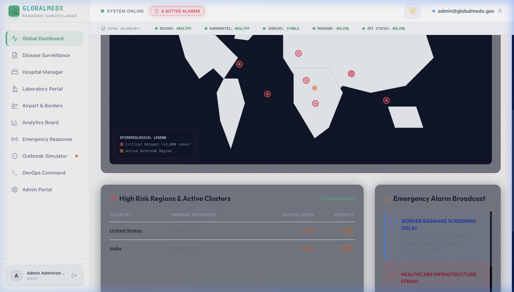

# GlobalMedX: Worldwide Pandemic Surveillance & Response Platform



GlobalMedX is an enterprise-grade, international public health platform designed to collect, analyze, and distribute real-time epidemiological information across the globe. During public health emergencies, this platform acts as the primary source of truth for disease tracking, outbreak prediction, resource allocation, and emergency response planning.

## 🚀 Features

* **Real-Time Command Center UI:** A premium, dark/light mode React dashboard visualizing global health data with Chart.js.
* **Outbreak Biosurveillance Map:** Visual representation of global disease hotspots.
* **DevOps Telemetry Boards:** Live streaming of system CPU, Memory, and Prometheus API metrics directly into the frontend.
* **Automated CI/CD:** Complete Jenkins pipeline for testing, linting, building, and pushing Docker images to Kubernetes.
* **Centralized Logging:** ELK stack (Elasticsearch, Logstash, Kibana) integration for microservice troubleshooting.
* **Secrets Management:** HashiCorp Vault securely manages database credentials and JWT tokens at runtime.
* **Infrastructure as Code:** Terraform scripts included to provision multi-AZ AWS VPCs and Kubernetes Clusters.

## 🏗️ Technology Stack

**Frontend:**
* React.js (Vite)
* Tailwind CSS (Custom Theme System)
* Chart.js & Lucide Icons

**Backend:**
* Node.js & Express.js
* MongoDB (Replica Sets)
* JWT Authentication

**DevOps & Infrastructure:**
* **Containers:** Docker & Docker Compose
* **Orchestration:** Kubernetes (K8s) with Horizontal Pod Autoscaler (HPA)
* **CI/CD:** Jenkins
* **Monitoring:** Prometheus & Grafana
* **Logging:** ELK Stack
* **Secrets:** HashiCorp Vault
* **IaC:** Terraform

## ⚙️ How It Works

1. **Client Tier:** The React SPA connects to the Node.js backend via RESTful JSON APIs.
2. **Security Tier:** The Express backend authenticates on boot with HashiCorp Vault to retrieve encrypted database URIs and signing secrets.
3. **Storage Tier:** MongoDB acts as the primary persistence layer for all hospital, outbreak, and telemetry data.
4. **Monitoring Loop:** A Prometheus scraper polls the backend `/metrics` endpoint every 10 seconds. Grafana reads this time-series data to visualize system health. Application logs are shipped to Elasticsearch via Logstash.
5. **Orchestration:** The entire stack is designed to be horizontally scaled via Kubernetes.

## 🛠️ How to Run Locally

### Prerequisites
* Docker & Docker Compose
* Node.js (for local non-docker testing)

### Quick Start (Full DevOps Sandbox)

You can spin up the entire microservices architecture (Frontend, Backend, MongoDB, Vault, ELK, Prometheus, Grafana) using Docker Compose:

```bash
# 1. Clone the repository
git clone https://github.com/adarsh985/globalmedx.git
cd globalmedx

# 2. Launch the full stack in detached mode
cd docker
docker compose up -d
```

### Accessing the Services
* **GlobalMedX Portal (Frontend):** [http://localhost:3000](http://localhost:3000)
* **Backend API Gateway:** [http://localhost:5001](http://localhost:5001)
* **Grafana Dashboards:** [http://localhost:3001](http://localhost:3001) *(Default Login: admin / admin)*
* **Prometheus Targets:** [http://localhost:9090](http://localhost:9090)
* **Kibana Logs UI:** [http://localhost:5601](http://localhost:5601)
* **HashiCorp Vault:** [http://localhost:8200](http://localhost:8200)

## 📁 Repository Structure

* `/frontend` - React SPA and UI components.
* `/backend` - Node.js Express API and Mongoose schemas.
* `/docker` - Dockerfiles and `docker-compose.yml`.
* `/k8s` - Kubernetes YAML manifests (Deployments, Services, HPA).
* `/terraform` - AWS Infrastructure as Code setup.
* `/jenkins` - Declarative Jenkinsfile pipeline.
* `/monitoring` - Prometheus & Grafana configurations.
* `/elk` - Logstash pipeline definitions.
* `/vault` - Vault initialization scripts.
* `/docs` - Project documentation and guides.

---
*Built as a comprehensive DevOps and Cloud Native Architecture demonstration.*
